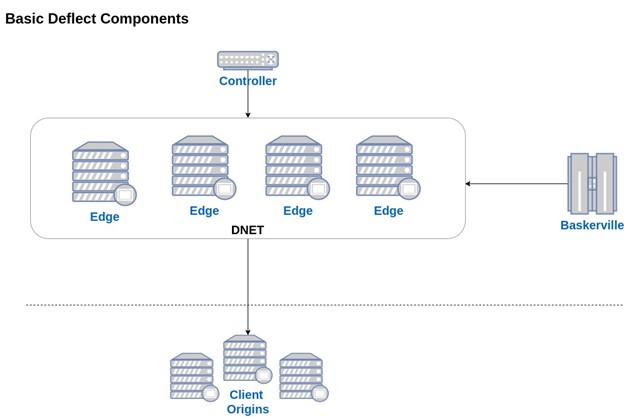
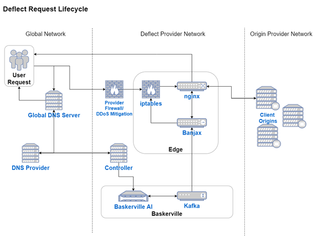

## Table of Contents
1. [What is Deflect](#what-is-deflect)
    1. [Overview](#overview)
    1. [Technology](#technology)
1. [Basic Component Overview](#basic-component-overview)
1. [Request Life-Cycle](#request-life-cycle)
1. [Components & Concepts](#components--concepts)
    1. [Controller](#controller)
    1. [Edge](#edge)
    1. [Baskerville](#baskerville)
    1. [DNETs](#dnets)
    1. [Edge Rotation/Management](#edge-rotationmanagement)
    1. [Content Caching](#content-caching)
    1. [ELK Stack](#elk-stack)
    1. [DNS Load Balancing](#dns-load-balancing)
1. [DNS](#dns)
1. [Hardware Considerations](#hardware-considerations)
    1. [Controller](#controller-1)
    1. [Edges](#edges)
1. [Installation](#installation)
1. [How to Run](#how-to-run)
    1. [Configuration](#configuration)
    1. [Orchestration](#orchestration)

 
# What is Deflect

## Overview

Deflect has specialized in defending high-profile human rights and independent media websites since 2010, serving millions of readers readers the world over and confounding the aims of state-sponsored hacking teams trying to silence them. We release our time tested tooling for standing up an entire DDoS mitigation infrastructure, including our machine learning anomaly detection system, as FOSS - to ensure that these protections are afforded to everyone and DDoS attacks cannot prevent freedom of expression and association on the Internet. We also tackle the problem of censorship from the user's perspective - looking to circumvent website censorship in their locale - in another one of our [projects.](https://censorship.no/)

This repository allows any individual or organization to set up their own DDoS mitigation service. It contains all necessary components to set up your network controller and edge servers - essentially acting as a reverse proxy to you or your clients' origin web servers. Nginx carries our edge server traffic, and our sidecar service Banjax helps it with access control decisions. Optionally, you can also install an instance of [Baskerville](https://github.com/deflect-ca/baskerville) - an anomaly detection system using machine learning to detect malicious network behaivour. Baskerville can be deployed as a module on your edge servers, communicating with our clearinghouse for predictions, or in its entirety with a base model.

## Technology

- [Docker](https://www.docker.com/)
- [Nginx](https://www.nginx.com/)
- [Certbot](https://certbot.eff.org/)
- [Bind9](https://hub.docker.com/r/internetsystemsconsortium/bind9)
- [Kafka](https://hub.docker.com/r/wurstmeister/kafka/)
- [ELK Stack](https://www.elastic.co/what-is/elk-stack) (for request logging and system metrics)
- [Banjax](https://github.com/deflect-ca/banjax) (our sidecar for Nginx written in Go)
- [Baskerville](https://github.com/deflect-ca/baskerville) (optional, can be used together with Deflect to detect anomalous traffic and with Banjax to challenge and ban anomalous behavior)

# Basic Component Overview

The diagram below visualizes the basic configuration of different Deflect components.



**Client Origins:** One or more web servers that host website platforms. They are protected from direct access to the outside world by having incoming connections proxied through one or more edges. All requests to your website(s) will come from these edges.

# Request Lifecycle

The diagram below highlights the request lifecycle inside a fully deployed Deflect DDoS mitigation infrastructure.



# Components &amp; Concepts

## Controller

We put our central services on a host called the controller. The most important parts are Bind9 and Certbot, for pointing DNS names at healthy edges and getting HTTPS certificates from LetsEncrypt. For demonstration purposes here, we have Elasticsearch and Kibana on the controller, though you might want to do that differently. And we have some services which help with end-to-end testing: a dns-over-https proxy (for setting up a browser that points to a staging environment), a pebble service (a fake LetsEncrypt backend), and a test origin server with some helper endpoints. The orchestration scripts in this repo can live anywhere, but the controller might be a natural place (a sysadmin's laptop would be the other obvious place, since the scripts don't need to run continuously).

That's a lot of important services, so you should take care to keep this server safe and online. We use a third-party DNS provider that sends zone transfers to our Bind server so that we can keep the IP hidden and reduce the attack surface.

## Edge

The edge server acts as a reverse proxy to the origin web servers. You can set up one or more edges in your network. And you can organize sets of edges into what we call Dnets (see below). Edges run two services: Nginx and [Banjax](https://github.com/deflect-ca/banjax). Nginx is well known, and it carries our traffic and caches content. Nginx talks to Banjax for access control help:

- Nginx asks Banjax whether requests it sees should be allowed, challenged (the familiar "checking your browser" page), or blocked. These decisions are cached so you don't pay the ~500us penalty every time.
- Banjax tails the Nginx access logs and matches regex rules to make blocking/challenging decisions (like fail2ban).
- Banjax creates and expires iptables ban rules.
- Banjax optionally talks to Baskerville (our machine learning bot classification service) over a Kafka bus.

## Baskerville

[Baskerville](https://github.com/deflect-ca/baskerville) is our ML-powered anomaly detection system. It's not included in this repo, but it analyzes access logs from the Elasticsearch cluster and communicates with Banjax over a Kafka bus. Anomalous-seeming IPs can be served challenge pages by Banjax, and bots that fail many challenge pages can be banned at the HTTP or IP levels.

## Dnets

In our experience protecting hundreds of websites with dozens of edges, we've found it useful to assign each website to a subset of the total edges. This has been useful for putting edges closer to a website's visitors, for allocating hardware resources fairly, and for quarantining the effects of internet censorship.

## Edge Rotation/Management

Not yet included in this repository is a service of ours called [edgemanage](https://github.com/deflect-ca/edgemanage). Edgemanage performs end-to-end health checks against edge servers and fills in Bind9 zone file templates with the healthiest ones. At the time of writing, it's still being extracted from our production systems and will soon be included here.

## ELK Stack

Single-node Elasticsearch clusters are easy to set up, and multi-node ones have a reputation as being a bit tough. We include a single-node ES cluster, a Kibana frontend, and a dashboard of handy queries, histograms, and plots.

## DNS Load Balancing

DNS round robin is a decades-old technique for balancing load across many servers. A widely-implemented IETF proposal called [Happy Eyeballs](https://en.wikipedia.org/wiki/Happy_Eyeballs) makes it even better. Instead of picking an essentially random IP from the set returned by a DNS server, clients will begin connections to many IPs at once, keep the winner, and close the rest. CDNs often use GeoIP databases to get closer to users, but this could be even better.

# DNS

If you want to protext example.com with Deflect, you just need to point the NS record at the Bind9 server included here (or if you're like us, you point it at at a third-party DNS host which in turn points at this one). That makes this Bind9 server authoritative, and our configuration generation here will serve A records pointing at the edge servers. At the time of writing, Edgemanage isn't included in this repo. We use it in production to direct traffic at our healthiest edge servers. It's currently being extracted from our production systems and will be integrated here shortly.

# Hardware Considerations

## Controller

By far the most resource-intensive service we run on the controller is Elasticsearch. There are two things you might want to benchmark here: the indexing speed (documents per second) and the querying speed (how fast your Kibana dashboard renders). It's going to depend a lot on your traffic, but a $40 VPS has sufficed for us in production.

## Edges

Nginx is going to be the resource-hungry one here, and you're going to have to benchmark it yourself.

# Installation

You can run the orchestration scripts from anywhere. They can be on the controller, or on your laptop. The following commands install the Python dependencies and make the scripts ready to run.

```bash
git clone https://github.com/equalitie/deflect-next-orchestration.git
cd deflect-next-orchestration
pip install -e .  # -e to make the scripts editable in place
```

Next, you need to make sure:
* your controller and edge IPs are in the appropriate config files.
* you have SSH access to the controller and edges from the user you're running the scripts as.

The next command SSHes into your controller and edges and basically does `apt install docker` (that's the only requirement for the host). You might have to tweak it a bit depending on the distros on the remote hosts.

```bash
python3 orchestration/install_base.py
```

Next we need to:
* generate the config files for Nginx, Bind, and Banjax
* build the necessary Docker images
* start all the Docker containers
* run certbot if necessary
* copy a bunch of config files and certs around and tell the main services to reload

That's a lot of moving parts, but if everything is in place, the following command does it all:

```bash
python3 orchestration/main.py
```

## Where you'll want to start looking when things don't work

A good starting point would be querying the Bind9 server for your website. Run `dig @127.0.0.1 example.com` on the controller. Maybe run it from a different vantage point.

You can force curl to connect through a specific edge like this:
```
curl --resolve example.com:443:127.0.0.1 https://example.com
```

A common problem is Nginx not being able to find certificates that you told it to look for. On any edge server, run
```
docker logs nginx-error-log-tailer-<timestamp>
```
and you'll see Nginx's error.log.

If you want to look at the output of the configuration generation code, you can look under `orchestration/output/<timestamp>/`.

You can get a shell into a Docker container with:
```
docker exec -it <container name> /bin/bash
```


## Configuration

The main configuration files are:

- orchestration/input/config.yml
- orchestration/input/old-sites.yml
- orchestration/system-sites.yml
- orchestration/deflect-next\_config.yml
- local\_certs\_dir = f&quot;input/certs/{formatted\_time}/&quot; # XXX formatted\_time comes from inside the old-sites.yml file

---

<a rel="license" href="http://creativecommons.org/licenses/by/4.0/">
</a><br />
This work is copyright (c) 2020, eQualit.ie inc., and is licensed under a <a rel="license" href="http://creativecommons.org/licenses/by/4.0/">Creative Commons Attribution 4.0 International License</a>.
